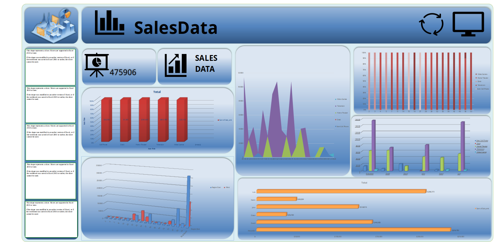

# 📊 Excel Sales Dashboard Project

This project demonstrates sales data analysis using Microsoft Excel. It showcases skills in data cleaning, pivot tables, dashboards, and insights generation.

## 📁 Files Included

- `SaleData.xlsx`: Main project file containing:
  - **Raw Data** (`SaleData` sheet)
  - **Pivot Tables** (`pivot` sheet)
  - **Dashboard** (`Dashboard` sheet)

## 🔍 Key Features

- Dynamic Pivot Tables by Item, Region, and Salesman
- Interactive Dashboard with:
  - Sales trends over time
  - Top 5 Salespersons
  - Category-wise performance
- Automated calculations using formulas (`Sale_amt = Units × Unit Price`)

## 📌 Tools Used

- Microsoft Excel
- Pivot Tables
- Charts and Slicers
- Basic Data Cleaning and Transformation

## 📸 Preview

 *(Upload a screenshot and name it `preview.png`)*

## 📥 How to Use

1. Download `SaleData.xlsx`
2. Open in Excel (2016+ recommended)
3. Explore the Dashboard and Pivot Tables

## 🧠 Learnings

- Improved understanding of data modeling in Excel
- Visual storytelling using charts
- Business insights extraction from raw sales data

---

### 📫 Contact

For queries or collaborations:
**Rajababu Ray**  
📧 [Your Email]  
📍 India  
